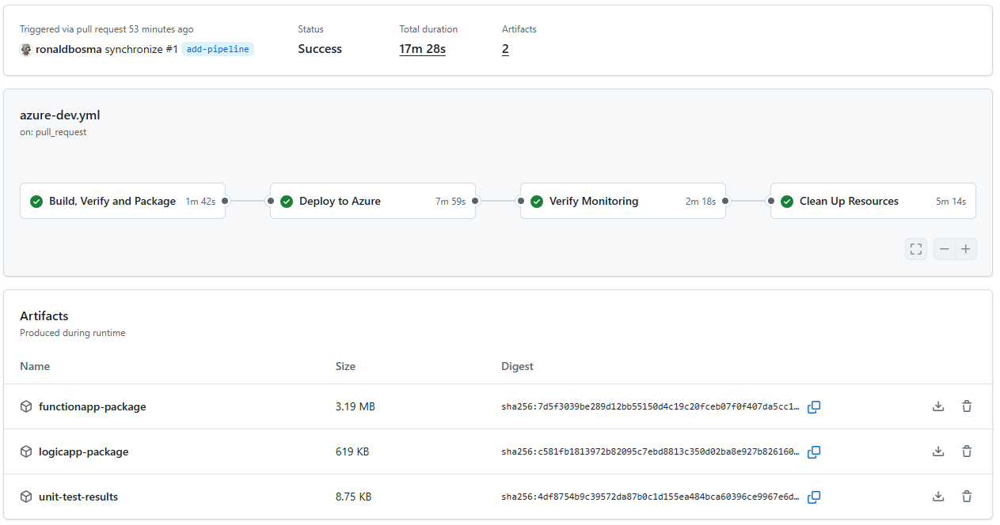
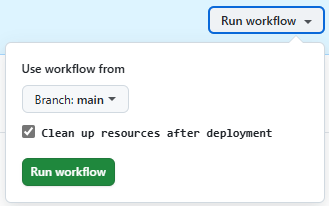

# Track Availability in Application Insights

An `azd` template (Bicep) that implements three different ways to track availability in Application Insights using: 
- a standard test (webtest)
- an Azure Function
- a Logic App workflow

## Overview

This template deploys the following resources:


The following availability tests are deployed:
- Two standard tests (webtest):
  1. Checks the availability of an API every 5 minutes from 5 locations
  1. Checks the validity of the SSL certificate of API Management
- Two Azure Functions:
  1. Checks the availability of an API every minute
  1. Checks the validity of the SSL certificate of API Management
- Two Logic App workflows:
  1. Checks the availability of an API every minute
  1. Checks the validity of the SSL certificate of API Management

For the backend, an API in API Management is used that randomly returns a `200 OK` or `503 Service Unavailable` response based on a configurable [approximate failure percentage](#approximate-failure-percentage). 

After deployment, availability test results should appear in Application Insights. See the following image for an example:  


When tests fail, alerts will fire in Azure Monitor.  See the following image for examples:  


See the [Demo Guide](demos/demo-availability-tests.md) for a more detailed overview of what's included in this template and how it works.

Some things to take note of:
- This sample uses Azure Functions to perform availability tests from code because they provide an easy way to trigger the tests on a schedule. You can use other services that host .NET code as well.
- The Logic App sample is not entirely low code. A [Logic App with custom .NET code](https://learn.microsoft.com/en-us/azure/logic-apps/create-run-custom-code-functions) is used in order to track the availability in Application Insights. 
- You can use any backend to check for availability, not just an API in API Management.

> [!IMPORTANT]  
> This template is not production-ready; it uses minimal cost SKUs and omits network isolation, advanced security, governance and resiliency. Harden security, implement enterprise controls and/or replace modules with [Azure Verified Modules](https://azure.github.io/Azure-Verified-Modules/) before any production use.


## Getting Started

### Prerequisites  

Before you can deploy this template, make sure you have the following tools installed and the necessary permissions.

**Required Tools:**
- [Azure Developer CLI (azd)](https://learn.microsoft.com/en-us/azure/developer/azure-developer-cli/install-azd)  
  - Installing `azd` also installs the following tools:  
    - [GitHub CLI](https://cli.github.com)  
    - [Bicep CLI](https://learn.microsoft.com/en-us/azure/azure-resource-manager/bicep/install)  
- [.NET 10 SDK](https://dotnet.microsoft.com/en-us/download/dotnet/10.0))  
- [npm CLI](https://nodejs.org/) 
  _(This template uses a workaround to deploy the Logic App workflow, which requires the npm CLI.)_
- This template includes several hooks that run at different stages of the deployment process and require the following tools. For more details, see [Hooks](#hooks).
  - [PowerShell](https://learn.microsoft.com/en-us/powershell/scripting/install/installing-powershell)
  - [Azure CLI](https://learn.microsoft.com/en-us/cli/azure/install-azure-cli?view=azure-cli-latest)

**Required Permissions:**
- You need **Owner** permissions, or a combination of **Contributor** and **Role Based Access Control Administrator** permissions on an Azure Subscription to deploy this template.

### Deployment

Once the prerequisites are installed on your machine, you can deploy this template using the following steps:

1. Run the `azd init` command in an empty directory with the `--template` parameter to clone this template into the current directory.  

    ```cmd
    azd init --template ronaldbosma/track-availability-in-app-insights
    ```

    When prompted, specify the name of the environment, for example, `track-availability`. The maximum length is 32 characters.

1. Run the `azd auth login` command to authenticate to your Azure subscription using the **Azure Developer CLI** _(if you haven't already)_.

    ```cmd
    azd auth login
    ```

1. Run the `az login` command to authenticate to your Azure subscription using the **Azure CLI** _(if you haven't already)_. This is required for the [hooks](#hooks) to function properly. Make sure to log into the same tenant as the Azure Developer CLI.

    ```cmd
    az login
    ```

1. Run the `azd up` command to provision the resources in your Azure subscription. This will deploy both the infrastructure and the sample application, and typically takes around 7 minutes to complete. _(Use `azd provision` to only deploy the infrastructure.)_

    ```cmd
    azd up
    ```

    See [Troubleshooting](#troubleshooting) if you encounter any issues during deployment.

1. Once the deployment is complete, you can locally modify the application or infrastructure and run `azd up` again to update the resources in Azure.

### Demo

See the [Demo Guide](demos/demo-availability-tests.md) for a step-by-step walkthrough on how to check and demonstrate the deployed availability tests.

### Clean up

Once you're done and want to clean up, run the `azd down` command. By including the `--purge` parameter, you ensure that the API Management service doesn't remain in a soft-deleted state, which could block future deployments of the same environment.

```cmd
azd down --purge
```

## Configuration

### Approximate failure percentage

The backend API will randomly return errors for an approximate percentage based on the `approximateFailurePercentage` parameter that is configured in [main.parameters.json](/infra/main.parameters.json). The default is 10%.

To change it to a different value, like 50%, run the following command before deploying the template:

```cmd
azd env set APPROXIMATE_FAILURE_PERCENTAGE 50
```

The value is used to create a named value in API Management called `approximate-failure-percentage`. 
The backend API has a policy that uses the named value to implement the logic to return either a `200 OK` or `503 Service Unavailable` response. 
See [backend-api.get-status.xml](/infra/modules/application/backend-api.get-status.xml) for the details.

### SSL certificate remaining lifetime days

The SSL certificate check availability test will fail if the API Management certificate expires within the specified number of days, which is set through the `sslCertRemainingLifetimeDays` parameter that is configured in [main.parameters.json](/infra/main.parameters.json). The default is 30 days.

To change it to a different value, like 365 days, run the following command before deploying the template:

```cmd
azd env set SSL_CERT_REMAINING_LIFETIME_DAYS 365
```

### Alert recipient email address

By default, no email notifications are sent when an alert is triggered. To enable email notifications, set the `alertRecipientEmailAddress` parameter before deploying the template by running the following command:

```cmd
azd env set ALERT_RECIPIENT_EMAIL_ADDRESS "your-email@example.com"
```

## Contents

The repository consists of the following files and directories:

```
├── .github                    
│   └── workflows              [ GitHub Actions workflow(s) ]
├── demos                      [ Demo guide(s) ]
├── hooks                      [ AZD hooks ]
├── images                     [ Images used in the README ]
├── infra                      [ Infrastructure As Code files ]
│   |── functions              [ Bicep user-defined functions ]
│   ├── modules                
│   │   ├── application        [ Modules for application infrastructure resources ]
│   │   ├── services           [ Modules for all Azure services ]
│   │   └── shared             [ Reusable modules ]
│   ├── types                  [ Bicep user-defined types ]
│   ├── main.bicep             [ Main infrastructure file ]
│   └── main.parameters.json   [ Parameters file ]
├── src                        [ Application code ]
│   ├── functionApp            [ Azure Functions ]
│   └── logicApp               [ Logic App workflow]
├── azure.yaml                 [ Describes the apps and types of Azure resources ]
└── bicepconfig.json           [ Bicep configuration file ]
```


## Hooks

This template has several hooks that are executed at different stages of the deployment process. The following hooks are included:

- [prepackage-logicapp-build-functions-project.ps1](hooks/prepackage-logicapp-build-functions-project.ps1): 
  This PowerShell script is executed before the Logic App is packaged. 
  It builds the custom .NET code project for the Logic App using the `dotnet build` command.

- [predown-remove-law.ps1](hooks/predown-remove-law.ps1): 
  This PowerShell script is executed before the resources are removed. 
  It permanently deletes all Log Analytics workspaces in the resource group to prevent issues with future deployments.
  Sometimes the requests and traces don't show up in Application Insights & Log Analytics when removing and deploying the template multiple times.


## Pipeline

This template includes a GitHub Actions workflow that automates the build, deployment, verify and cleanup process. The workflow is defined in [azure-dev.yml](.github/workflows/azure-dev.yml) and provides a complete CI/CD pipeline for this template using the Azure Developer CLI.



The pipeline consists of the following jobs:

- **Build, Verify and Package**: This job sets up the build environment, validates the Bicep template, executed unit tests and packages the Function App and Logic App.
- **Deploy to Azure**: This job provisions the Azure infrastructure and deploys the packaged applications to the created resources.
- **Verify Monitoring**: This job verifies that the availability tests are running and reporting results to Application Insights.
- **Clean Up Resources**: This job removes all deployed Azure resources.  

  By default, cleanup runs automatically after deployment. This can be disabled via an input parameter when the workflow is triggered manually.

  

### Setting Up the Pipeline

To set up the pipeline in your own repository, run the following command:

```cmd
azd pipeline config
```

Follow the instructions and choose either **Federated User Managed Identity (MSI + OIDC)** or **Federated Service Principal (SP + OIDC)**, as OpenID Connect (OIDC) is the authentication method used by the pipeline.

For detailed guidance, refer to:
- [Explore Azure Developer CLI support for CI/CD pipelines](https://learn.microsoft.com/en-us/azure/developer/azure-developer-cli/configure-devops-pipeline)
- [Create a GitHub Actions CI/CD pipeline using the Azure Developer CLI](https://learn.microsoft.com/en-us/azure/developer/azure-developer-cli/pipeline-github-actions)

> [!TIP]
> By default, `AZURE_CLIENT_ID`, `AZURE_TENANT_ID` and `AZURE_SUBSCRIPTION_ID` are created as variables when running `azd pipeline config`. However, [Microsoft recommends](https://learn.microsoft.com/en-us/azure/developer/github/connect-from-azure-openid-connect) using secrets for these values to avoid exposing them in logs. The workflow supports both approaches, so you can manually create secrets and remove the variables if desired.

> [!NOTE]
> The environment name in the `AZURE_ENV_NAME` variable is suffixed with `-pr{id}` for pull requests. This prevents conflicts when multiple PRs are open and avoids accidental removal of environments, because the environment name tag is used when removing resources.


## Troubleshooting

### API Management deployment failed because the service already exists in soft-deleted state

If you've previously deployed this template and deleted the resources, you may encounter the following error when redeploying the template. This error occurs because the API Management service is in a soft-deleted state and needs to be purged before you can create a new service with the same name.

```json
{
    "code": "DeploymentFailed",
    "target": "/subscriptions/00000000-0000-0000-0000-000000000000/resourceGroups/rg-track-availability-sdc-cliqc/providers/Microsoft.Resources/deployments/apiManagement",
    "message": "At least one resource deployment operation failed. Please list deployment operations for details. Please see https://aka.ms/arm-deployment-operations for usage details.",
    "details": [
        {
            "code": "ServiceAlreadyExistsInSoftDeletedState",
            "message": "Api service apim-track-availability-sdc-cliqc was soft-deleted. In order to create the new service with the same name, you have to either undelete the service or purge it. See https://aka.ms/apimsoftdelete."
        }
    ]
}
```

Use the [az apim deletedservice list](https://learn.microsoft.com/en-us/cli/azure/apim/deletedservice?view=azure-cli-latest#az-apim-deletedservice-list) Azure CLI command to list all deleted API Management services in your subscription. Locate the service that is in a soft-deleted state and purge it using the [purge](https://learn.microsoft.com/en-us/cli/azure/apim/deletedservice?view=azure-cli-latest#az-apim-deletedservice-purge) command. See the following example:

```cmd
az apim deletedservice purge --location "swedencentral" --service-name "apim-track-availability-sdc-cliqc"
```

### Function App deployment failed because of quota limitations

If you already have a Consumption tier (`SKU=Y1`) Function App deployed in the same region, you may encounter the following error when deploying the template. This error occurs because you have reached the region's quota for your subscription.

```json
{
  "code": "InvalidTemplateDeployment",
  "message": "The template deployment 'functionApp' is not valid according to the validation procedure. The tracking id is '00000000-0000-0000-0000-000000000000'. See inner errors for details.",
  "details": [
    {
      "code": "ValidationForResourceFailed",
      "message": "Validation failed for a resource. Check 'Error.Details[0]' for more information.",
      "details": [
        {
          "code": "SubscriptionIsOverQuotaForSku",
          "message": "This region has quota of 1 instances for your subscription. Try selecting different region or SKU."
        }
      ]
    }
  ]
}
```

Use the `azd down --purge` command to delete the resources, then deploy the template in a different region.

### Logic App deployment failed because of quota limitations

If you already have a Workflow Standard WS1 tier (`SKU=WS1`) Logic App deployed in the same region, you may encounter the following error when deploying the template. This error occurs because you have reached the region's quota for your subscription.

```json
{
  "code": "InvalidTemplateDeployment",
  "message": "The template deployment 'logicApp' is not valid according to the validation procedure. The tracking id is '00000000-0000-0000-0000-000000000000'. See inner errors for details.",
  "details": [
    {
      "code": "ValidationForResourceFailed",
      "message": "Validation failed for a resource. Check 'Error.Details[0]' for more information.",
      "details": [
        {
          "code": "SubscriptionIsOverQuotaForSku",
          "message": "This region has quota of 1 instances for your subscription. Try selecting different region or SKU."
        }
      ]
    }
  ]
}
```

Use the `azd down --purge` command to delete the resources, then deploy the template in a different region.
